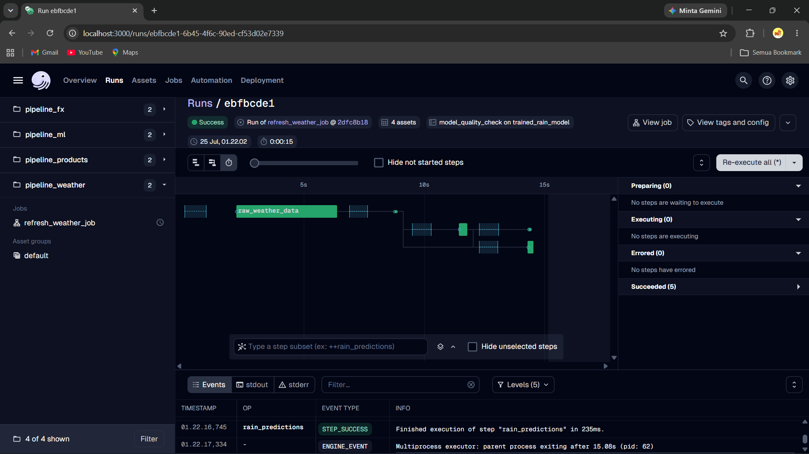
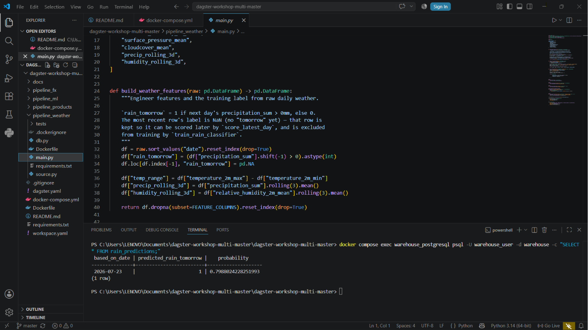

# dagster-weather-pipeline

A Dagster MLOps pipeline that fetches live daily weather data and predicts
whether it will rain tomorrow, using a Random Forest classifier. Built as
my capstone extension to a multi-container Dagster workshop — I picked this
track because I'm interested in ML/prediction work and wanted to try it
against a real, live external API instead of static data.

Built on top of [dagster-workshop-multi](https://github.com/DanielAdif/dagster-workshop-multi),
a multi-container Dagster workshop — see that repo's README for the base
architecture (`pipeline_products`, `pipeline_fx`, `pipeline_ml`).

## What I built

- **Track:** C — MLOps pipeline
- **Data source:** [Open-Meteo Archive API](https://open-meteo.com/en/docs/historical-weather-api) —
  free, no API key required, ~2 years of daily historical weather (temperature,
  precipitation, wind, humidity, pressure, cloud cover) for a given location.
- **Key assets:**
  - `raw_weather_data` — fetches ~2 years of daily historical weather from Open-Meteo, live, on every run
  - `weather_features` — engineers features (temp range, 3-day rolling precipitation/humidity) and builds the `rain_tomorrow` training label
  - `trained_rain_model` — trains a `RandomForestClassifier` (200 trees, max depth 6) and reports test-set accuracy
  - `rain_predictions` — scores the most recent day and writes the prediction (rain/no rain + probability) to the warehouse
- **Quality gate:** `model_quality_check` — an `@asset_check` on `trained_rain_model` that fails the run if accuracy drops below **60%**. I chose 60% as a minimum viable bar for a binary classifier (better than a coin flip) without being so strict that the check is flaky on a small, simple feature set.

## Architecture

```
pipeline_products        pipeline_fx              pipeline_ml
  (products/orders)       (exchange rates)          (order value predictions)
        |                       |                          |
        └───────────────────────┴──────────────────────────┘
                                 |
                     warehouse_postgresql (shared)
                                 |
        ┌────────────────────────────────────────────────┐
        │                pipeline_weather                │
        │                                                │
        │  raw_weather_data ──> weather_features ──>     │
        │       (Open-Meteo API)   (feature eng.)        │
        │                              |                 │
        │                    trained_rain_model          │
        │                       |            |           │
        │              model_quality_check   |           │
        │              (@asset_check)        v           │
        │                            rain_predictions    │
        │                          (writes to warehouse) │
        └────────────────────────────────────────────────┘
```

`pipeline_weather` is fully independent — it doesn't read from the other
pipelines' tables — but it's wired into the same Dagster deployment
(`docker-compose.yml`, `workspace.yaml`) and writes to the same shared
warehouse Postgres, so its `rain_predictions` table is queryable right
alongside `products`, `orders`, and `order_value_predictions`.

## Running it

```bash
docker compose up --build
```

Open http://localhost:3000, find `pipeline_weather` under Deployment >
Code Locations, and materialize its assets (or use the `refresh_weather_job`
job, which is also scheduled to run daily).

To inspect the predictions directly:

```bash
docker compose exec warehouse_postgresql psql -U warehouse_user -d warehouse -c "SELECT * FROM rain_predictions;"
```

## Demo



*(All four assets — `raw_weather_data`, `weather_features`, `trained_rain_model`,
`rain_predictions` — materialize successfully, and `model_quality_check` passes.)*



*(The pipeline predicted an 80% chance of rain the day after 2026-07-23,
queried straight from the warehouse Postgres.)*

## What I'd do differently in production

- **No historical prediction log** — `rain_predictions` uses `if_exists="replace"`, so each run overwrites the previous prediction instead of appending. In production I'd append with a run timestamp so I could track prediction accuracy over time.
- **No real model registry or versioning** — the trained model only exists in memory during a run. I'd use an actual model registry (e.g. MLflow) so I could roll back to a previous model if a retrain underperforms.
- **No retries or alerting** — if the Open-Meteo API is briefly down, the run just fails. I'd add retry policies on `raw_weather_data` and hook `model_quality_check` failures into a real alerting channel (Slack, PagerDuty) instead of just failing silently in the UI.
- **Single location, hardcoded** — latitude/longitude are hardcoded defaults in `source.py`. A production version would take location as a run config parameter so the same pipeline could serve predictions for multiple cities.
- **No secrets management** — database credentials are plain environment variables in `docker-compose.yml`, fine for a local workshop but not something I'd do with real infrastructure behind it.
